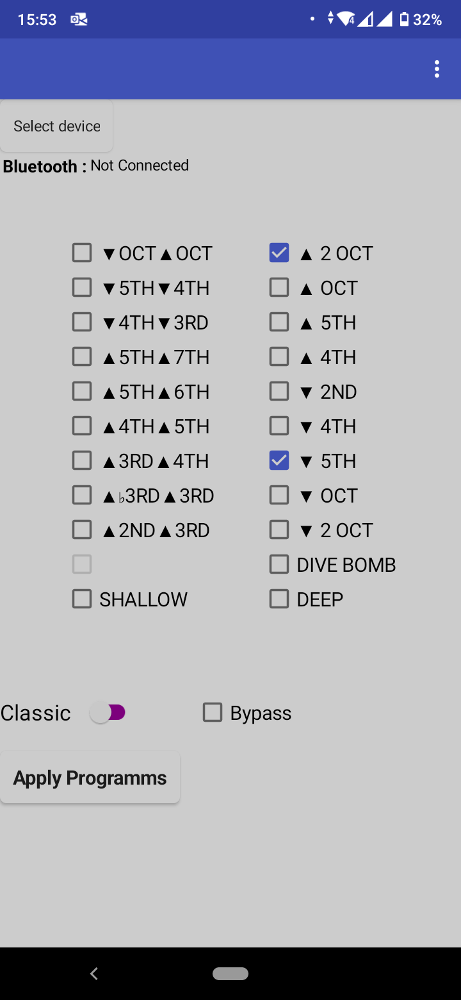
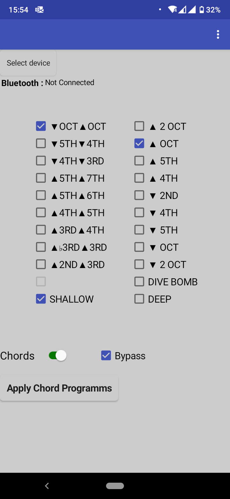
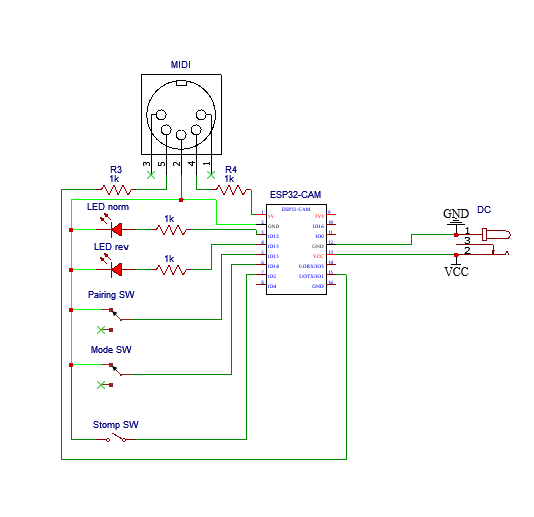

# Digitech Whammy 5 MIDI Controller With Bluetooth Interface

This is a MIDI controller for the Digitech Whammy 5/ Bass with an arduino pro-mini 5V/16MHz. 
With this implementation you can select the programs you want and loop only among them. You can send the program in classic or chords mode, and in active or bypass mode by adding the correct amount according to the whammy manual. This is a variation of the Bluetooth controller with restrictions in the midi output (if it is active/bypass chord/classic) but with a cheaper microcontroller and with no need of external compatibility (the app in the phone).

## Saving Process

By turning the switch in the saving mode position you can navigate through the programs and press the save button to add or remove a program. The led_norm led will indicate if the program is already saved in memory.

)
)

## Playing

When the switch is in playing mode you scroll through the saved programs by pressing the stomp switch. Reverse mode is also available.

##Schematic 

)
